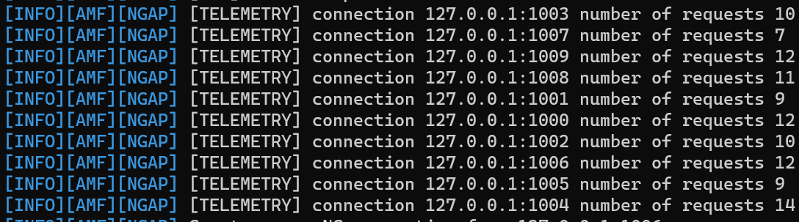
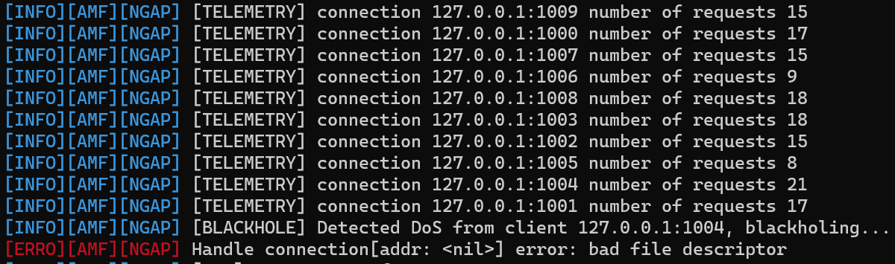

# 5g_blackholing

This repository contains the installation and running tutorials for the "Desenvolvimento de Software Orientado à Computação Móvel e Ubíqua" class assignment.


## Setting up the Environment

1- Download an image of a debian-based linux with kernel version 5.4.0-167-generic. For reference, the image used in the development of this assignment was: Ubuntu Server 20.04.6 LTS

2- Create a virtual machine using virtual box, the VM must have:
-Two network interfaces interfaces: a NAT interface and a Host-only interface. These interfaces must be added before the installation of the OS. 

- At least 2 Gb of RAM.
- At least 25 Gb of Disk Space.
- IMPORTANT: After creating the VM, Virtual Box will launch the installation automatically. Close the VM and shut it down to add the extra network interface before the installation.

3- Boot the VM and, during installation of the OS, make sure to install OpenSSH server.

4- After the installation is complete, start the VM and log in.
- IMPORTANT: do not turn off the machine after finishing this environment set up. If you have to close it, save the machine state instead of turning it off.
	

5- From the VM, run the *"ip a"* command, take note the ipv4 inet address of the Host-only interface for accessing it remotely from your main OS. We won't be using the main interface from Virtual Box, but accessing the VM via SSH.

6- From a terminal in your main OS (powershell in Windows or Bash in Linux), run:
```
ssh "user"@"ip"
```
*"user" is the username you chose during the installation and "ip" being the ip address you took note during Step 5*

7- Repeat the previous step on one more terminal, so you have two instances connected to the VM.

8- From one of your terminals:

8.1- Installation of my5G-core, following the steps described [here](https://github.com/my5G/my5G-core/wiki/Install-from-source).

8.2- After that, go back to your home directory and proceed with the installation of my5G-RANTester, following the steps described in [here](https://github.com/my5G/my5G-RANTester/wiki/Install-from-source).
	*Installation of Go is not required if you installed it on step 8.1. Up to step 3 of Tester Installation is enough.*

8.3- Lastly, go back to your home directory once again and proceed to cloning this repository and checking out to the master repository:
```
cd
git clone https://github.com/r-bazo/5g_blackholing/
cd 5g_blackholing
git checkout master
cd
```

9- From your home directory, run the following commands:
```
mv 5g_blackholing/my5G-core/dispatcher.go my5G-core/src/amf/ngap/
mv 5g_blackholing/my5G-RANTester/app.go my5G-RANTester/cmd/
mv 5g_blackholing/my5G-RANTester/test-amf-requests-per-second-custom.go my5G-RANTester/internal/templates/
cd my5G-RANTester/cmd/
go build app.go
cd
cd my5G-core
make all
cd
```

Now you should have my5G-core and my5G-RANTester installed with the customized files.

## Running the Simulation

On one terminal, go to the my5G-core folder:
```
cd my5G-core
```

And run the core with:
```
sudo ./run.sh
```

You should see the 5g core debug messages being printed on the screen.

On the other terminal, go inside the my5G-RANTester/cmd/ folder:
```
cd my5G-RANTester/cmd/
```
and run the test with: 
```
sudo ./app amf-load-loop-custom -n 10 -t 60
```
This test will create random clients up to a total of 10 clients and send 10 requests per second to the my5G-core, the test will run for 60 seconds. You should start seeing new messages.

The output of the custom files can be seen in the my5G-core outputs, where there are telemetry outputs from each clients, such as:

*This specific debug output will appear for each batch of requests sent by the test script running on the other terminal.*


Let the test code execute for a certain time and at some point you should see clients with a larger number of requests being blackholed:

*This means that that connection was dropped by the core, avoiding what could be a potential DoS attack.*


## Potential Future Works

This assignment can be extended in many ways, such as:

1- Implementing DoS detection in the core with communication from end to end (UE to UE).

2- Using a another metric for evaluating a DoS detection, in this assignment IP is being used, but in the context of 5g networks it is not a reliable metric. For instance, we could use IMSI or SUPI.

3- Distribute the simulated environments in different machines. In this assignment everything is running on the same host. We could distribute UEs to different machines to replicate a scenario that more closely resemble the real-world.
